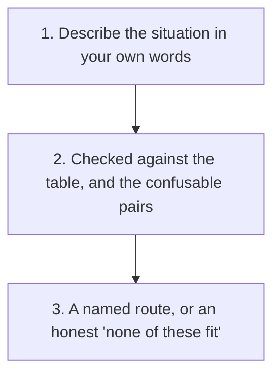

# Sibling Projects Router

You do not need to install anything to try this once: copy this whole file, paste it as your first message in any AI chat tool, then follow it with your actual situation.

Someone describing a real situation rarely names the tool they need; they describe the problem. This reads that description and hands off to the right existing tool, without trying to solve the task itself and without inventing a new method one of the nineteen already covers.

**Want clickable choices?** [Open the interactive tool picker](https://shaunmarsden.github.io/sibling-projects/).

## Gather the Inputs

- The actual goal, in your own words, not a guess at which tool you mean
- Whether this is still open and undecided, or has already closed one way or another
- Whether this is about one thing, or several similar-sounding things you are trying to compare
- The main blocker or open question, if one is apparent

## Route to the Right Tool

| Situation described | Route to |
| --- | --- |
| Writing up a meeting and want confirmed facts kept separate from estimates and assumptions | [Evidence-Labelled Meeting Notes](https://github.com/shaunmarsden/evidence-labelled-meeting-notes) |
| Want a scoring rubric for judging AI output in a specific domain, not a fixed one that does not fit | [Build Your Own AI Output Rubric](https://github.com/shaunmarsden/build-your-own-rubric) |
| Have a repeated task and want a proper, bounded skill file instead of a one-off prompt | [Skill Author](https://github.com/shaunmarsden/skill-author) |
| Have a book, course, or policy document and want it structured as a skill instead of loaded whole | [Book to Skill](https://github.com/shaunmarsden/book-to-skill) |
| A tracked status, on track, done, in progress, might not actually match the evidence behind it | [Claims vs. Evidence Checker](https://github.com/shaunmarsden/claims-vs-evidence-checker) |
| A list or spreadsheet might have duplicates, missing fields, or stale rows | [List Hygiene Checker](https://github.com/shaunmarsden/list-hygiene-checker) |
| Something has already failed or closed, and you want to know if it is genuinely over | [Post-Mortem Builder](https://github.com/shaunmarsden/post-mortem-builder) |
| Someone has gone quiet and you are deciding whether, and what, to send next | [The Quiet Follow-Up](https://github.com/shaunmarsden/the-quiet-follow-up) |
| A customer complaint has come in and you want to diagnose the real driver before replying | [Diagnose Before You Respond](https://github.com/shaunmarsden/diagnose-before-you-respond) |
| Weighing a decision (a job offer, a vendor, a project idea) with more than one aspect to judge | [Is This Actually a Good Fit?](https://github.com/shaunmarsden/is-this-a-good-fit) |
| Someone else has agreed to present your case to a third party you cannot be in the room for | [Brief Your Advocate](https://github.com/shaunmarsden/brief-your-advocate) |
| Need a written case for a decision-maker who was not part of the original conversations | [Make the Case](https://github.com/shaunmarsden/make-the-case) |
| Want a weekly view of your own work composed from what you already have, no dashboard | [Weekly Roundup Builder](https://github.com/shaunmarsden/weekly-roundup-builder) |
| A decision is still open and stalled, "let me think about it" has gone on longer than it should | [What's Actually Causing This Delay?](https://github.com/shaunmarsden/whats-causing-this-delay) |
| You keep seeing what sounds like the same complaint or issue across several instances and want to know if it is one real pattern | [Is This Really a Pattern?](https://github.com/shaunmarsden/is-this-really-a-pattern) |
| Sending the same template message to more than one recipient, or one recipient who needs to forward part of it | [Personalise, Don't Templatise](https://github.com/shaunmarsden/personalise-dont-templatise) |
| Have an important conversation coming up and the useful information is scattered | [Prep Card Builder](https://github.com/shaunmarsden/prep-card-builder) |
| Reaching out cold to someone you do not know, and want an opener anchored to something real rather than a generic observation | [First Contact That Isn't Generic](https://github.com/shaunmarsden/first-contact-that-isnt-generic) |
| Two records that are each supposed to reflect the same thing, a count, a status, a set of dates, and you need to know where they actually disagree | [Do These Actually Match?](https://github.com/shaunmarsden/do-these-actually-match) |

### Common Confusions Worth Checking Explicitly

Reading this pasted into an AI chat, use the question under each pair below. Browsing on the web instead, [the interactive tool picker](https://shaunmarsden.github.io/sibling-projects/) covers the same decisions as clickable cards. The detailed tool pages still set out their own limits and guardrails.

#### Closed outcome or ongoing delay?

[Open Post-Mortem Builder skill](https://github.com/shaunmarsden/post-mortem-builder/blob/main/SKILL.md) · [Open What's Actually Causing This Delay skill](https://github.com/shaunmarsden/whats-causing-this-delay/blob/main/SKILL.md)

#### Stated complaint or vague delay?

[Open Diagnose Before You Respond skill](https://github.com/shaunmarsden/diagnose-before-you-respond/blob/main/SKILL.md) · [Open What's Actually Causing This Delay skill](https://github.com/shaunmarsden/whats-causing-this-delay/blob/main/SKILL.md)

#### One record or a whole list?

[Open Claims vs. Evidence Checker skill](https://github.com/shaunmarsden/claims-vs-evidence-checker/blob/main/SKILL.md) · [Open List Hygiene Checker skill](https://github.com/shaunmarsden/list-hygiene-checker/blob/main/SKILL.md)

#### Several instances or one decision?

[Open Is This Really a Pattern skill](https://github.com/shaunmarsden/is-this-really-a-pattern/blob/main/SKILL.md) · [Open Is This Actually a Good Fit skill](https://github.com/shaunmarsden/is-this-a-good-fit/blob/main/SKILL.md)

#### An advocate or a document?

[Open Brief Your Advocate skill](https://github.com/shaunmarsden/brief-your-advocate/blob/main/SKILL.md) · [Open Make the Case skill](https://github.com/shaunmarsden/make-the-case/blob/main/SKILL.md)

#### First contact or an arranged conversation?

[Open First Contact That Isn't Generic skill](https://github.com/shaunmarsden/first-contact-that-isnt-generic/blob/main/SKILL.md) · [Open Prep Card Builder skill](https://github.com/shaunmarsden/prep-card-builder/blob/main/SKILL.md)

- **None of these fit:** say so plainly rather than forcing the closest match. Suggest raising it as a new idea in a [sibling-projects discussion](https://github.com/shaunmarsden/sibling-projects/discussions) instead of inventing a method on the spot.

## Produce a Clean Handoff

Once a route is chosen, state:

- **The objective**: what the user is actually trying to achieve, in one sentence
- **The recommended tool**: named directly, with a link
- **Why this route fits**: the specific detail that pointed here rather than to a similar-sounding alternative
- **What it will need from you**: what the recommended tool's own gathered inputs require
- **What still requires a person**: carried forward from the recommended tool's own guardrails, not reset to a blank slate

## Apply the Guardrails

- Never solve the underlying task in place of the tool being recommended
- Never force a fit when the described situation does not actually match anything in the table; say so
- Do not assume which tool fits from a single keyword; check the actual situation against the confusions above when two tools sound similar

## Require Human Review

This recommends a route and prepares a handoff. Actually running the recommended tool, and everything it in turn requires a person to check, stays exactly as documented in that tool.

For a fictional worked example, including one that deliberately tests the Post-Mortem Builder versus What's Actually Causing This Delay confusion above, read [the worked example](router-example/). Use [the review checklist](checks/checklist.md) before acting on a routing decision.
